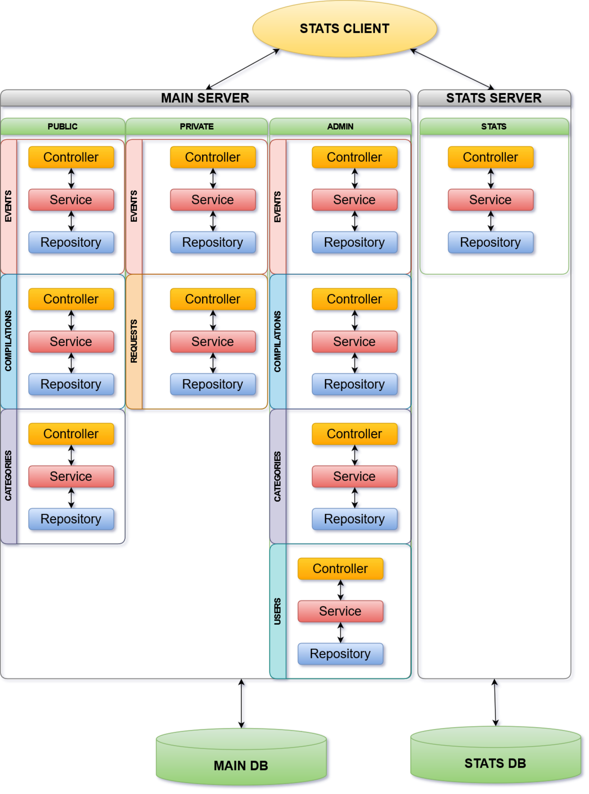
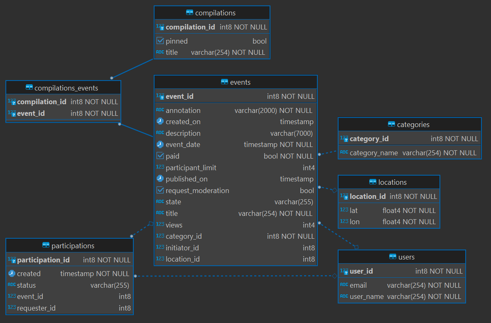
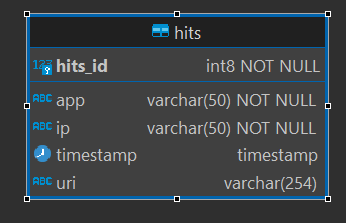

[Pull request](https://github.com/NadezhdaNovikova/java-explore-with-me/pull/1)

# _REST API для проекта "Explore With Me"_

### _Язык реализации Java_

## _Дипломная работа на курсе Java-разработчик (Яндекс.Практикум, 3 когорта)_

### _Схема Архитектуры проекта_

Приложение — афиша, где можно предложить какое-либо событие от выставки до похода в кино и набрать компанию для участия в нём.

### Спецификация:
#### Основной сервис: https://github.com/NadezhdaNovikova/java-explore-with-me/blob/main/ewm-main-service-spec.json
#### Сервис статистики: https://github.com/NadezhdaNovikova/java-explore-with-me/blob/main/ewm-stats-service-spec.json

### _Схема DB основного сервиса_

### _Схема DB сервиса статистики_

### _Дополнительный функционал - ветка feature_

### Типы локаций:

Публичный сервис:
- получение списка типов локаций;
- получение типа локации по Id;

Сервис администратора:

- добавление нового типа локации;
- изменение типа локации;
- удаление типа локации.

### Локации:

Публичный сервис:
- получение списка событий в локации;

Сервис администратора:

- добавление новой локации;
- изменение локации;
- получение списка локаций (полного и по id локаций);
- получение списка локаций в радиусе указанной локации с расстоянием до них.